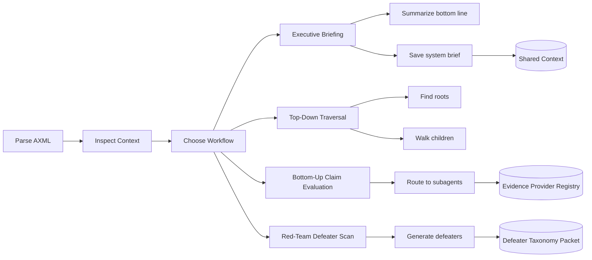
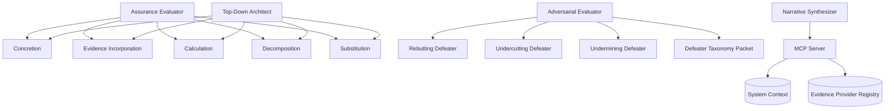

# Agentic Assurance Cases

This repository contains an OpenCode-based environment for evaluating Claim-Argument-Evidence (CAE) assurance cases using the Helping Hand notation. It uses a local Model Context Protocol (MCP) server to parse and inspect Adelard ASCE `.axml` files as structured graphs instead of raw XML.

## Features
* **Assurance Evaluator Agent:** The primary agent that routes claims to the right justification strategy.
* **Top-Down Architect Agent:** A root-first orchestrator that walks the assurance tree downward using targeted MCP navigation tools.
* **Narrative Synthesizer Agent:** A human-facing briefing mode plus a shared system-context generator for downstream agents.
* **Specialized Assurance Subagents:** Evidence Incorporation, Calculation, Decomposition, Substitution, and Concretion.
* **Adversarial Evaluator Agent:** A red-team pass with rebutting, undercutting, and undermining defeater strategies.
* **ASCE Parser MCP Server:** Local tools for parsing `.axml`, fetching neighborhood context, inspecting immediate children, finding roots, managing shared system context, discovering evidence providers, and writing targeted updates back to a case.
* **Defeater Taxonomy Packet:** A structured challenger prompt packet with route mappings, concrete examples, STRIDE/STPA-Sec overlays, and refutation guardrails.
* **Schema-Aware Parsing:** The parser uses `schemas/ASCAD 2.0.xml` as the source of truth for node, link, and status-field metadata.

## Workflow Relationships



## Agent Relationships



## Installation & Setup

1. **Clone the repository:**
   ```bash
   git clone https://github.com/beLizzard1/AgenticAssuranceCases.git
   cd AgenticAssuranceCases
   ```

2. **Install the MCP server dependencies:**
   ```bash
   python -m venv .venv
   source .venv/bin/activate
   pip install -r mcp-server/requirements.txt
   ```

3. **Open the repo in OpenCode:**
   - The local MCP server is configured in `opencode.json`.
   - The OpenCode agent files live under `.opencode/agents/`.

4. **Run against an `.axml` file:**
   - Use the included sample case in `examples/` or point the agents at your own `.axml` file.
